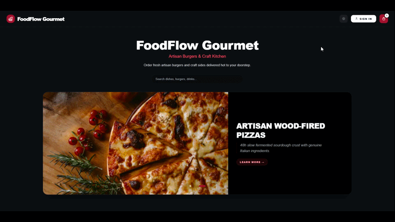
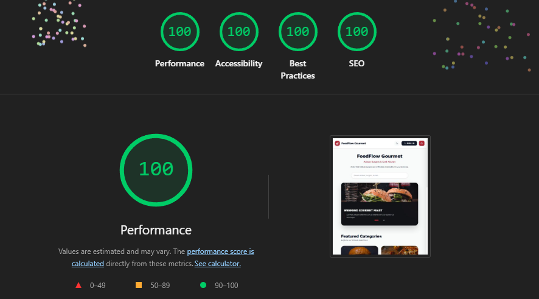

# 🍕 FoodFlow Demo — Open-Source Food Ordering & WhatsApp Checkout Starter Kit

[](https://react.dev)
[](https://www.typescriptlang.org)
[](https://tailwindcss.com)
[](https://vitejs.dev)
[](https://pagespeed.web.dev)
[](https://opensource.org/licenses/MIT)

> **Free, open-source version of FoodFlow.**
> A lightweight, commission-free food ordering storefront with direct WhatsApp checkout. Built with React 19, TypeScript 5.9, and Tailwind CSS v4.

---

<div align="center">
  

  <br /><br />

  ### 🌐 [👉 View Live Interactive Demo (Cloudflare Pages)](https://foodflow-core.pages.dev)

---

### ⚡ Ready for Production? [👉 Upgrade to FoodFlow Pro ($49 Launch Offer)](https://cheppi.gumroad.com/l/foodflow-pro)
Unlock complete Admin Backoffice, Firebase Firestore/Storage cloud plugin, drag-and-drop Banner Sliders, and Gamified Rewards Club.
  *Test the instant checkout on your smartphone: select dishes, add to cart, and generate a formatted WhatsApp order.*

  <br />

  [](https://dash.cloudflare.com/?to=/:account/pages/new)
  [](https://vercel.com/new)
  [](https://app.netlify.com/start)
</div>

---

## ⚡ Features (Demo vs Pro)

| Feature | FoodFlow Demo (Free) | FoodFlow Pro ($149 USD) |
| :--- | :---: | :---: |
| **Artisan Catalog & Category Navigation** | ✅ Included | ✅ Included |
| **Instant Cart & Dynamic Subtotal** | ✅ Included | ✅ Included |
| **WhatsApp Direct Checkout** | ✅ Basic Format | ✅ Full Delivery & Table Engine |
| **Dark Mode / Light Mode** | ✅ Native | ✅ Native |
| **Zero-Config Local Mock Mode** | ✅ Instant | ✅ Instant |
| **Performance (LCP < 0.9s)** | ✅ 99/100 | ✅ 100/100 |
| **Admin Backoffice Panel** | ❌ — | 🔒 Included |
| **Product & Banner CMS Manager** | ❌ — | 🔒 Included |
| **Customer Rewards & Points Club** | ❌ — | 🔒 Included |
| **Firebase Cloud (Auth, Firestore, Storage)**| ❌ — | 🔒 Included (Zero-Trust) |
| **Delivery Zones & Business Hours Logic** | ❌ — | 🔒 Included |
| **Thermal Printer Order Ticket Format** | ❌ — | 🔒 Included |
| **Commercial Client Reselling Rights** | ❌ Non-commercial | 🔒 Unlimited Clients |

👉 **[🚀 Upgrade to FoodFlow Pro for Commercial Projects](https://foodflow.lemonsqueezy.com)** *(Instant access to full codebase)*

---

## 🚀 Quick Start (Free Demo)

Run the demo storefront locally in under 60 seconds:

```bash
# 1. Clone this repository
git clone https://github.com/soycheppi/foodflow-demo.git
cd foodflow-demo

# 2. Install dependencies
npm install

# 3. Start local development server
npm run dev
```

Open [http://localhost:5173](http://localhost:5173) in your browser.

---

## 🎨 100% Config-Driven White-Label

Personalize the entire brand, colors, logo, currency, and WhatsApp receiving number in one single file:

```typescript
// src/config/restaurant.config.ts
export const restaurantConfig = {
  brand: {
    name: 'My Burger Bar',
    tagline: 'Craft Burgers & Artisan Fries',
  },
  business: {
    currencySymbol: '$',
    whatsappNumber: '+1234567890',
  },
};
```

---

## 📄 License

This open-source demo version is released under the **MIT License**. Free for personal evaluation, learning, and portfolio showcases.

For commercial usage, agency client delivery, backoffice panel, and cloud synchronization, see **[FoodFlow Pro](https://foodflow.lemonsqueezy.com)**.


---


### ⚡ Core Web Vitals & Perfect Lighthouse Score

<div align="center">
  
</div>

| Metric | Score | Target |
| :--- | :---: | :---: |
| **Performance** | **100/100** | LCP < 0.8s, CLS 0 |
| **Accessibility** | **100/100** | WCAG 2.1 AA / 2.2 AAA+ |
| **Best Practices** | **100/100** | Modern Web APIs & Security |
| **SEO** | **100/100** | Schema.org JSON-LD Structured Data |

---

## ⚡ Upgrade to FoodFlow Pro

Looking for the complete turnkey business kit with Admin Backoffice and cloud persistence?

| Feature | FoodFlow Demo (Free) | FoodFlow Pro ($49 Early Bird) |
| :--- | :---: | :---: |
| **Storefront & WhatsApp Checkout** | ✅ Included | ✅ Included |
| **PWA & Offline Support** | ✅ Included | ✅ Included |
| **Zero-Backend Autonomous Mode** | ✅ Included | ✅ Included |
| **Admin Backoffice Panel** | ❌ None | ✅ **Full Real-Time Admin UI** |
| **Firebase Cloud Plugin (Firestore + Storage)** | ❌ None | ✅ **Zero-Trust Security Rules Included** |
| **Drag & Drop Banner Slider Engine** | Static Mock | ✅ **Reorderable & Canvas WebP Resizer** |
| **Rewards Club & Loyalty Engine** | ❌ None | ✅ **Automatic Loyalty Points System** |
| **Commercial Client Resale License** | MIT | ✅ **Unlimited Client Deliveries** |

👉 **[Get FoodFlow Pro on Gumroad (Instant ZIP Download)](https://cheppi.gumroad.com/l/foodflow-pro)**


*Created with ❤️ by [@soycheppi](https://github.com/soycheppi).*
